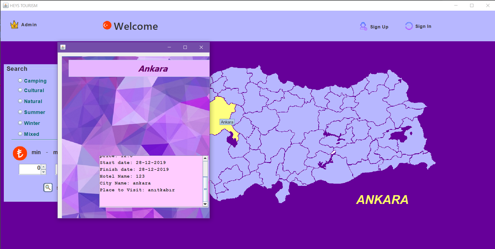
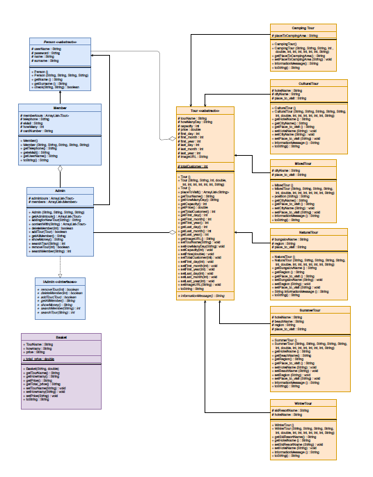
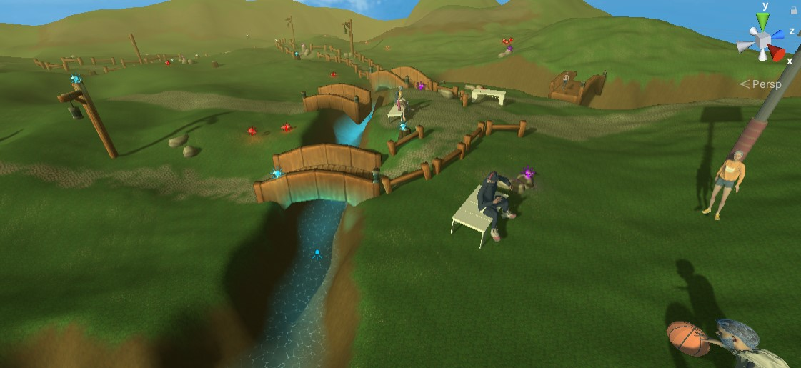
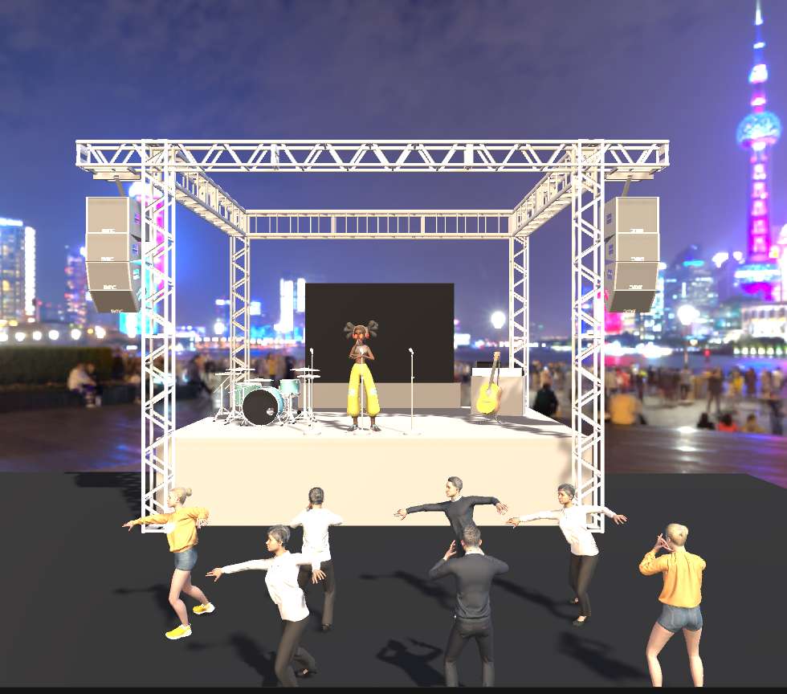
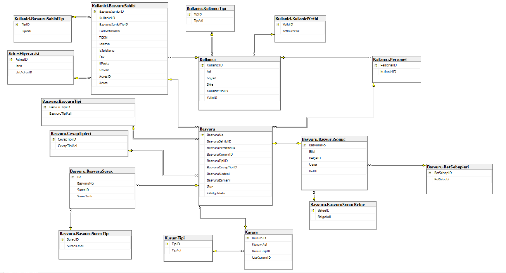
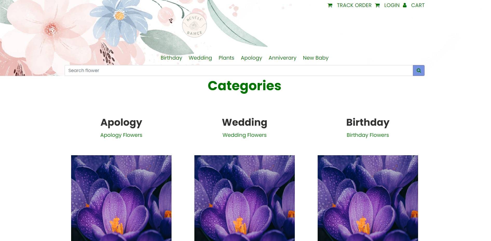
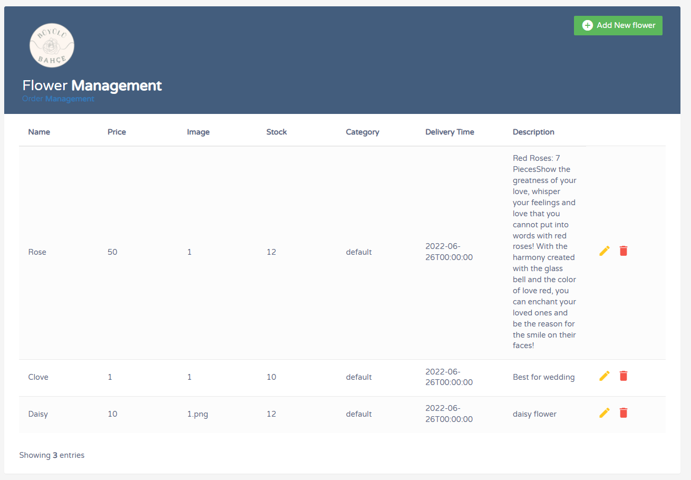
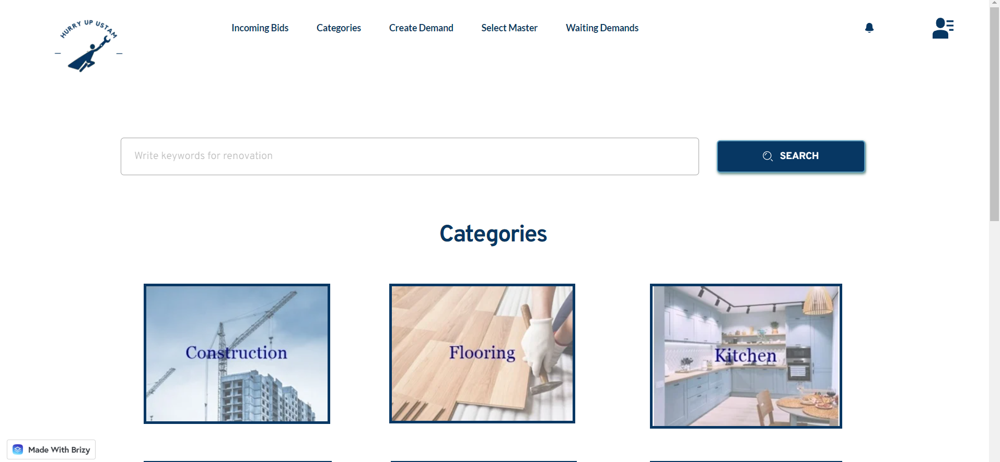
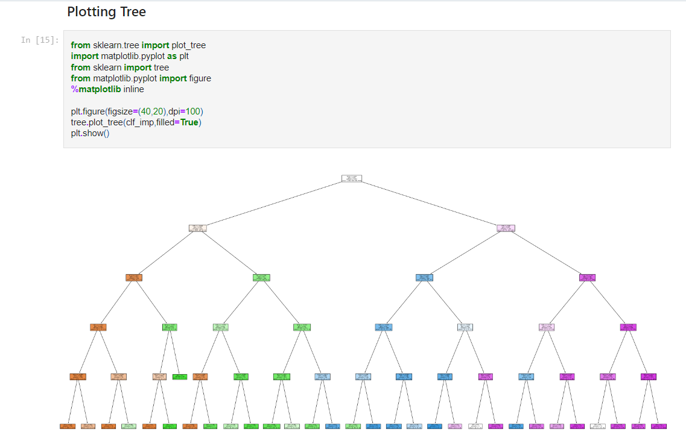

### Elif Şahingöz

## Education

- Computer Engineering in Ankara Yildirim Beyazit University

  B.S. in Computer Engineering [GPA: 3.59]

## Work Experience

### Software Engineer, Tubitak

**Keywords:** C++, Qt, CMake, QMake, XML, Wireshark, Microsoft Visual Studio Code, CLR, RAD Studio, SVN, Confluence, State Machine, Visual Paradigm, TeamCenter, Computer Network, Communication with Hardware

    
Details

  
  * Developed desktop application using C++, adhering to SOLID principles and system architecture was optimized with various design patterns.
  
  * Utilized communication protocols such as UART, UDP and MIL-STD- 1553.
    
  * Prepared and maintained software documentation, keeping track of technical documents.
    
  * Coordinated with other engineers to evaluate and improve software for hardware testing.
    
  * Integrated third-party tools and components into applications.
    

  
### DevOps Intern, Turksat

**Keywords:** Java Spring, Docker, Kubernetes, Ubuntu, Linux Mint, Maven, Swagger, Postman, Apache OpenWhisk, OpenFaas, AWS, Web Services, REST

    
Details

  
  * Conducted research on Docker, Kubernetes, Postman and FaaS technologies.
  
  * Gained experience in serverless architecture with Function as a Service (FaaS) such as Apache OpenWhisk and OpenFaas.
    
  * Worked on Linux systems for researches.
        

### Frontend Developer Intern, BiSoft

**Keywords:** VSCode, Nginx, Angular, React, Git, GitLab

    
Details

  
  * Enhanced web applications using React and Angular frameworks.

  * Used Git for version control and collaborative project development.
            

## Project

### FotoRing

**Keywords:** React, JavaScript, Pagination, CSS, EXIF Data

    
Details

  
  * Project image:

       

### Tourism Management System

**Keywords:** Java, Swing, OOP, SOLID

    
Details

    * Implemented project using Java to demonstrate proficiency in OOP concepts.
    
    * Designed and developed graphical interface with Swing.
  
    * Project image:
  

     * Project design:
    
       

### Thesis Project CoVR

**Keywords:** C#, Unity, VR, Literature Searching, Write Paper, Project Management, Presentation, Graphics

    
Details

    * Collaborated with HAVELSAN in SUIT program. Using C# and Unity game engine, explored the intersection of psychology and computer science.
    
    * Investigated the impact of virtual reality technology on users' emotions and response.
  
    * Project image:
 

       

### Information Rights project such as CIMER

**Keywords:** Database Design, MSSQL, MVC, Java

    
Details

    * Designed and implemented a well-structured database using MSSQL.
    
    * Written with MVC architecture using Java.
  
    * Database design:

       

### E-Store Clone Flowers

**Keywords:** Softeare Requirement Specialist, MSSQL, .NET 6.0, JavaScript, Docker, Jira, Github, Agile

    
Details

    * Developed MSSQL, .NET 6.0, JavaScript and Docker.
    
    * Utilize jira and github for project process.
  
    * Project image:

       

### Hurry up Ustam

**Keywords:** Interview with Users, Research Application, UI/UX, Design System, Mock Systems

    
Details

    * Researched and analyzed existing similar projects to identify usability strengths and challenges
    
    * Focused on Human-Computer Interaction principles
  
    * Project image:

       

### Machine Learning/Artificial Intelligence

**Keywords:** Python, Algorithms

    
Details

  
    * Project image:

       

### Notes:
overal project: https://github.com/elifsz/Undergraduate-Projects

## Skills

- Programming Languages: Java, C, C++, Python(ML)
  
- Database: MSSQL
  
- Web Technologies: HTML, CSS, JavaScript, React
  
- Frameworks & Libraries: Qt, C++/CLI
  
- DevOps & Version Control: Docker, GitLab, SVN
  

**Keywords:** Cyber Security, Virtual Reality, Web Application, Desktop Application, Machine Learning, Database Management, Multithread Applications, Data Structures, Algorithms
